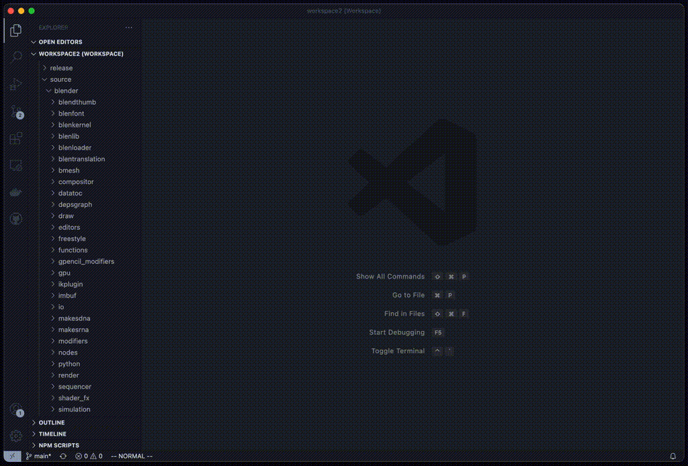
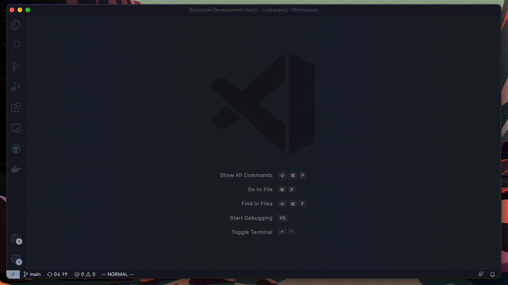

# FindItFaster

[](https://github.com/tomrijndorp/vscode-finditfaster/actions?query=branch%3Amain)
%20%7C%20windows%20powershell%20(experimental)-334488)

Finds it, but faster.  

Make sure to check the [Requirements](#requirements) below (TL;DR: have `fzf`, `rg`, `bat` on your
`PATH`).

<hr />

Default key bindings:
- `cmd+shift+j` / `ctrl+shift+j` to search files,
- `cmd+shift+u` / `ctrl+shift+u` to search for text within files,
- `cmd+shift+ctrl+u` / `ctrl+shift+alt+u` to search for text within files with type pre-filtering.

You can change these using VS Code's keyboard shortcuts.

<hr />

Update: Native Windows support is now implemented (still experimental)! Also see
[Known Issues](#known_issues).

<hr />

## Features
This plugin is useful if you deal with very large projects with lots of files (which makes VS Code's
search functionality quite slow), or when you simply love using `fzf` and `rg` and would like to
bring those tools inside VS Code, similar to how the excellent `fzf.vim` plugin works for Vim.

This extension exposes four commands:
1. Search for files and open them. Uses a combination of `fzf`, `rg`, and `bat`.
2. Search within files for text and open them. Uses a combination of `fzf`, `rg`, and `bat`.
3. Like 2., but you can limit the file types that will be searched.
4. Resume search. Repeats the last run command with the previous query prepopulated.

If your active text editor has a selection, it will be used as the initial query (you can disable
this setting).

⬇️ &nbsp;**Find files**


⬇️ &nbsp;**Find text within files**


⬇️ &nbsp;**Find text within files, with file type filter**


This extension has also been tested on remote workspaces (e.g. SSH sessions).

<hr />

<a name="requirements"></a>
## Requirements

This plugin opens a terminal inside VS Code. Make sure that you can run `fzf`, `rg`, and `bat` by
running these commands directly in your terminal. If those work, this plugin will work as expected.
If it doesn't, confirm that you are running recent versions of all three tools.

If you're not familiar with these command line tools, you might want to check them out. They are
awesome tools that can be individually used and make you more productive. And when combined such as
for instance in this extension, they're very powerful. They're available for many platforms and easy
to install using package managers or by simply installing a binary.

- [`fzf` ("command-line fuzzy finder")](https://github.com/junegunn/fzf)
- [`rg` ("ripgrep")](https://github.com/BurntSushi/ripgrep)
- [`bat` ("a cat clone with wings")](https://github.com/sharkdp/bat)

I have no affiliation with any of these tools, but hugely appreciate them, and wanted to bring them
into a VS Code context.

<hr />

## Extension Settings

See the settings for this extension in the GUI.  
You might want to play with `fzf`, `rg` and `bat` on the command line and read their manuals in
order to get a better understanding of some of the settings in this extension. It will be worth
your time.

<hr />

<a name="known_issues"></a>
## Known Issues

**Windows**. There are two ways of running this extension on Windows:
1. **Natively using Powershell**. This feature was added as of May 2022 and is experimental at this
stage. Please file an issue on [Github]( https://github.com/tomrijndorp/vscode-finditfaster/issues)
if you find one.
2. **Through WSL** (Windows Subsystem for Linux). You can run this extension inside a [Remote-WSL
workspace](https://marketplace.visualstudio.com/items?itemName=ms-vscode-remote.remote-wsl).

**Not tested on Docker / Github code spaces**. Will likely work without issues as the
functionality is very similiar to other remote sessions (e.g. SSH, WSL).

**Various small terminal issues**. VS Code gives developers little control over the terminal. We
can't know if you typed text into the terminal we create, so that might interfere with the
extension. There are various subtle ways in which in which things can break, many of which can't be
detected. That said, if you don't touch the FindItFaster terminal, things should work well!

<hr />

## FAQ

### 🕹 _How do I control the fuzzy finder view?_
➥ Whatever defaults are present on your system (and read by VS Code) are used. For `fzf`, this means
&lt;Ctrl+K&gt; moves the selection up, &lt;Ctrl+J&gt; moves down, and &lt;Enter&gt; selects. You can
also use the up and down arrows if that's your thing. &lt;TAB&gt; for multiple select when
available. Read the excellent `fzf` [documentation](https://github.com/junegunn/fzf#readme) to learn
more about using `fzf`.

### ⬆️ _I'm on Linux and I can't use Ctrl+K to navigate upwards in `fzf`._
➥ Probably VS Code is waiting for you to complete a multi-step keyboard shortcut (chord). Change the
  following setting in your preferences to disable chords:
  ```
  "terminal.integrated.allowChords": false
  ```

### 🔍 _There's a file that cannot be found / searched through?_
➥ This extension enables you to search through multiple directories: the process working directory,
  the workspace directories, and any additional directories you specify in the extension settings.
  What paths are included is configured through the settings. There's a `listSearchLocations`
  command that can show you which paths are currently being indexed.

### 🧘 _Can you give focus back to my editor / my problems panel / other?_
➥ I don't the VS Code API enables me to do this. Shoot me a message if you think I'm mistaken and
  I'll try to make this better.  
  Update: Added a setting `find-it-faster.general.killTerminalAfterUse`. When true, it will kill the
  extension's terminal which may result in VS Code focusing the previous one. It may help you.

### 🐞 _I found a bug!_  
➥ Yeah, that's not unlikely. There are a lot of edge cases with this sort of tooling. Three options:
  1. Shrug :)
  2. File a Github issue. Please give detailed information as the devil is in the details. Please
     provide at least:
     - OS
     - VS Code version
     - Does it happen after you reset to default settings (if relevant)?
     - Anything special about your configuration / workspace. Did you have spaces in there? Is it
       on a network share or some other thing I definitely didn't test? Did you modify the extension
       settings?
  3. Create a fix and open a PR. If it's a straightforward fix that doesn't require a lot of testing
     on my side, I'll probably merge it. Please don't underestimate the amount of testing I need to
     do even for a trivial fix, and consider that this is just a tiny side project for me. I might
     not respond that quickly.

### 💩 _I don't like `fzf` / `rg` / `bat`. Can I just use `find`, `grep`, and `cat` or something else?_  
➥ This is not impossible for me to do, but realistically, there's little value to it. The experience
  will never be quite as good, and won't be as performant either.  
  `rg` especially is a beast that outperforms `grep` and even tools like `ag`. Give them a try.
  Plus, not supporting additional tools means more time to make this extension better and fewer
  opportunities for creating bugs. You can file a Github issue and see if there's support for it,
  but unless people _really_ want this it's unlikely I'll support it.  
  You _can_ actually already use other preview tools than `bat`, e.g. `cat`. I've left some hints in
  the settings.

### 💲 <i>Can I set FZF env vars that only work within this extension?</i>
➥ You can, by adding something like this to `~/.bashrc` or whatever configures your enviroment:
```bash
if [[ $FIND_IT_FASTER_ACTIVE -eq 1 ]]; then
  FZF_DEFAULT_OPTS='--height=50%'
fi
```

### 🎄 <i>I'd like to customize this tool a little but I need access to &lt;insert something here&gt;. Can you expose that?</i>  
➥ I probably can. Maybe create a Github issue and ask for it? Especially if other people vote on it,
  that would be a compelling argument to do it.

### 🪚 _Can I  build in a feature myself / contribute in some way?_
➥ To minimize redundancy, have a look at `CONTRIBUTING.md`.

### 🤑 _Do you take donations?_
➥ Thanks for asking, but no. The amount of work that went into this extension is tiny compared to
  the countless hours that have gone into the command line tools that are leveraged in this
  extension. Please support those tools instead.  
  What I do appreciate is if you'd help others find this extension by spreading the word and/or
  leaving a rating!

<hr />

## Release Notes

### 0.0.26
- Resume search added as a new command. Resumes the last invoked command with the same query. Thanks
  for implementing @alexrenz!
- Add feature to kill terminal after each use such that focus goes back to the previous terminal

### 0.0.25
- Fix for UTF-8 paths on Windows. Thanks @ch0pex!

### 0.0.24
- No user facing changes

### 0.0.023
- Address Dependabot security issues

### 0.0.22
- Bug fix on Windows that caused files to not open. Thank you @ObieMunoz for reporting and
  @Coombszy! for submitting a fix!

### 0.0.21
- Add option to open editors in preview window. Thank you @phrabos!

### 0.0.20
- Experimental windows support! Thanks so much @ihdavids!

### 0.0.19
- Add a new command: `search file (with type filter)`. Thanks for suggesting @prime31!
- Add option to set the `bat` theme. Thanks for suggesting @mariush2!
- Add `--cycle` to `fzf` call. Thanks for suggesting @shlomocarmeter!
- Fix some bugs that caused `search within files` to behave incorrectly

### 0.0.18
- Add an option to use the contents of `.gitignore` files to limit search paths (on by default)

### 0.0.17
- Fix a bug that caused `search within files` to not search in all paths

### 0.0.16
- Ensure text selection searches immediately
- Small bug fix where the extension wouldn't correctly initialize when a text selection was present

### 0.0.15
- Show relative paths when only one directory is on the search path

### 0.0.14
- Fix a bug in `search within files` on Linux
- Prevent custom PS1 prompt from leaking into user's history
- Fix a bug regarding fzf version discovery (e.g. Homebrew, Ubuntu 21.04 installs)

### 0.0.13
- Lower minimum required VS Code version to 1.48
- Small bug fix in type filtering window
- New screen captures in README

### 0.0.12
- Option to "find within files", but pre-filter by file type.  
  Exposes a new keyboard shortcut (default: `cmd+shift+ctrl+u` / `ctrl+shift+alt+u`).  
  The selection is stateful; it will be kept across searches such that you can easily re-run a
  search with the same file types. Should add new screen captures, but will do that in 0.0.13.

### 0.0.11
- Bug fix: bring back preview window in "Find Files"

### 0.0.10
- No new features, but this version should be automatically published through Github Actions.

### 0.0.9
- Much better search path support (see extension settings)
  - Option to add the process working directory under various conditions
  - Option to disable searching the workspace folders
  - Option to add additional search paths through the settings under various conditions
- Better error message for native Windows use case
- Filtering out stderr output when searching. Prevents messing up `fzf`'s layout when permissions
  errors arise during searching.
- Add basic CI sanity checks and badge.
- Small logo update

### 0.0.7
- Text selections: if you have text selected, we'll use that to fill `fzf`'s query. There's an
  option to disable it.
- Clean up some terminal spam

### 0.0.6
- Honor search.exclude setting and add option to disable
- Don't store command history
- Always run bash in terminal, add warning to PS1

### 0.0.3
- Support multiple sessions at the same time without interfering with one another.
- Option to disable checks (e.g. `which bat`). Useful if you want to use e.g. `cat` instead.
- Option to disable previews for each of the find commands
- Settings overhaul; they're now empty when default. Enables some more flexibility on the backend.
- Cosmetic improvements if using fzf >= 0.27

### 0.0.2
- SSH support 🎉
- Ignore .git directory
- Always show error dialog box when a dependency isn't found
- Default search location preference for when a session has no workspace
- Add screen captures showing functionality
- Add an ugly icon
- Various smaller fixes

### 0.0.1
You gotta start somewhere!

Tested on these configurations:

**Mac OS**:
```
OS         : Darwin 20.1.0 (MacOS Big Sur 11.0.1)
bat version: bat 0.18.0
fzf version: 0.27.1 (brew)
rg version : ripgrep 13.0.0
```

**Linux**:
```
OS         : Linux 5.8.0-55-generic (Ubuntu 20.04)
bat version: bat 0.12.1
fzf version: 0.20.0
rg version : ripgrep 12.1.1 (rev 7cb211378a)
```
